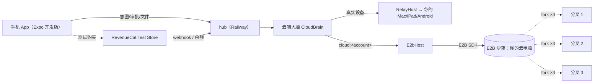

# 云电脑（E2B）+ RevenueCat，参加 Shipaton 2026 学生组

## 背景

- 现状：CuaRemote 只能控制你自己的 Mac / iPad / Android，设备不在线就什么都做不了。云端大脑已经有了（[apps/hub/src/cloud-brain.ts](../../apps/hub/src/cloud-brain.ts)、[packages/brain/src/cloud/cloud-brain.ts](../../packages/brain/src/cloud/cloud-brain.ts)），但它只会通过 `RelayHost` 把工具调用转给真实设备（`hostFor`，第 144 行）。
- 可以直接复用的部分：
  - `Host` 接口（[packages/brain/src/host/types.ts](../../packages/brain/src/host/types.ts)）。
  - `Pty` 接口和 `TerminalManager`（[packages/brain/src/terminal/pty.ts](../../packages/brain/src/terminal/pty.ts)，构造时传入 `spawn: () => Pty`）。
  - `CreditLedger` 接口，以及按 runId 保证只扣一次的预扣和结算逻辑（[apps/hub/src/billing.ts](../../apps/hub/src/billing.ts) 第 170、191 行）。
  - `DevicePlatform` 里已经有 `"cloud"`（[packages/protocol/src/common.ts](../../packages/protocol/src/common.ts) 第 137 行）。
- 参考 [tiny_container](https://github.com/Cateners/tiny_container)：它在 Android 手机本机上用 PRoot 跑 Debian。我们把机器放到云上，只借鉴它的用法：
  - 终端、桌面、网页预览是三个独立入口。
  - 端口真正起来之后才打开预览。
  - 常用命令做成可以点的卡片。
  - 系统分享菜单能把文件发进来。

  它是 GPL-3.0 协议，**我们不抄它的代码**。
- Shipaton 2026 学生组（Next Gen）的规则（[官方规则](https://revenuecat-shipaton-2026.devpost.com/rules)）：
  - 截止时间：**2026-09-30 23:45（太平洋时间）**，雅加达时间 10 月 1 日 13:45。
  - 不用上架，只交演示视频（2 分钟内，YouTube 或 Vimeo 公开，要拍到 App 在对应设备上运行）和**公开的开源仓库**（带许可证文件，能在 GitHub 仓库首页看到）。
  - App 必须是 iOS / iPadOS / macOS / Android App，至少有一笔购买走 RevenueCat SDK。
  - 评审主要看三点：RevenueCat 用得是否用心，技术选择和产品思考，做得和讲得是否用心。
- RevenueCat **Test Store**：每个新项目自带。用 Test Store 的 key，不需要苹果或谷歌开发者账号，就能跑完整的测试购买，发放权益和虚拟货币，数据也会出现在后台。React Native SDK 最低版本 9.5.4。它必须在开发版 App 里用，Expo Go 里只有模拟调用。

## 整体结构

## A. packages/cloud-computer：云电脑本体

- `E2bHost implements Host`：
  - 提供的工具：
    - `shell.run`：`sandbox.commands.run`，带超时，输出过长会截断。
    - `fs.list` / `fs.read` / `fs.write`。
    - `cloud.preview`：等端口真正起来，再用 `sandbox.getHost(port)` 生成链接。
    - `cloud.download`：生成一次性下载地址。
    - `browser.screenshot`：用沙箱里的无头 Chromium 截图，给分叉结果做对比。
  - 工具等级按沙箱里的实际风险定：沙箱内的增删改和装软件都是 L0，因为整台机器可以撤销。L2 只留给三类操作：把预览设成公开链接、注入密钥（第二阶段）、对外推送（例如 `git push`，靠命令匹配识别）。Jev 预检照常跑。
- `E2bPty implements Pty`：包装 `sandbox.pty.create / sendInput / resize / kill`。现有 `TerminalManager` 的分帧、背压、OSC 133 命令块都能直接用。
- `CloudComputers`（每个账号一台）：
  - `ensure(accountId)`：没有就用模板创建，有就用 `Sandbox.connect(id)` 唤醒（约 1 秒）。
  - 创建时设 `lifecycle.onTimeout: 'pause'`，默认空闲 10 分钟后暂停。
  - 暂停的机器 E2B 会一直保留，只有删除账号时才 `kill`。
  - 累计运行秒数，给计费用。
- 自定义 E2B 模板 `cuaremote-cloud`：
  - Debian，预装 python3/uv、node/bun、git、ffmpeg、pandoc、ImageMagick、无界面 LibreOffice、无头 Chromium，以及 OSC 133 shell 集成脚本。
  - 工作目录 `/home/user/work`。
- 快捷命令卡：写在 `cards.yaml` 里，格式由我们自己定。第一批：
  - PDF 转 Word
  - 视频压缩 / 剪片段
  - 录音转文字
  - 起一个网页服务并预览
  - 克隆仓库并跑测试

  手机上点一张卡，就填好参数发出对应的意图。

## B. hub 接线

- [apps/hub/src/db.ts](../../apps/hub/src/db.ts)：新增两张表。
  - `cloud_computers(account_id, sandbox_id, status, template, last_active_at, run_seconds, created_at)`
  - `cloud_snapshots(account_id, run_id, snapshot_id, created_at)`
- 设备列表 `devicesFor` 多一台虚拟设备：
  - id 是 `cloud:<account>`，platform 是 `cloud`，名字叫「云电脑」。
  - 状态分三种：运行中、已暂停、未创建。
  - 它不走配对，也不走 HPKE 中继，因为大脑和执行都在 hub 里，所以这一档 hub 能看到明文，要在界面上写清楚。
- [packages/brain/src/cloud/cloud-brain.ts](../../packages/brain/src/cloud/cloud-brain.ts) 的 `hostFor(deviceId)`：
  - 遇到 `cloud:` 开头的 id，向构造时传入的 `cloudHost(accountId)` 要一个 `E2bHost`。
  - 其他设备照旧走 `RelayHost`。
  - brain 包不直接依赖 E2B SDK。
- 终端：手机对云电脑发 `terminal.open`，hub 用 `TerminalManager({ spawn: () => new E2bPty(...) })` 处理，签名校验照旧。
- 计费：`settle` 时，`Cost` 里加上沙箱运行秒数乘以单价。每个分叉出来的机器都单独计时。

## C. 协议

在 [packages/protocol/src/messages.ts](../../packages/protocol/src/messages.ts) 里新增以下消息，改完运行 `bun run gen`：

- `cloud.status` / `cloud.wake`：机器状态、剩余额度、上次活跃时间。
- `cloud.upload.begin`：返回预签名上传地址。`cloud.download`：返回下载地址。大文件不走 WebSocket。
- `cloud.preview.ready { port, url, public }`：沙箱里有端口起来了，推送给手机。
- 分叉相关三条：
  - `cloud.variants { runId, items: [{ forkId, summary, screenshot?, previewUrl?, diffStat }] }`
  - `cloud.pick { runId, forkId }`
  - `cloud.undo { runId }`

## D. 分叉挑选和整机撤销

- 每次 run 开始前，先调用 `sandbox.createSnapshot()` 存一份快照，快照 id 记进 `cloud_snapshots`，只保留最近 5 个。
- 意图带 `variants: 2|3` 时，用 `sandbox.fork({ count })` 复制机器。每份跑同一个意图，但加一句不同的思路提示，例如「最少改动」「重新设计」「换一种工具」，然后各跑一个 agent loop。它们同时进行，发出的事件都带 `forkId`。
- 所有分叉跑完后，每份生成摘要，再附上截图（有预览就截预览页）或改动统计，打包成 `cloud.variants` 发给手机。
- 用户选中一份后，把 `cloud_computers.sandbox_id` 换成选中的那台，旧的主机器和没选中的分叉都 `kill`。
- 整机撤销：从快照新建一台机器，替换当前这台。
- 分叉份数：免费用户 1 份（也就是不分叉），`pro` 用户最多 3 份。这样付费功能在视频里看得见。

## E. RevenueCat

- 在 RevenueCat 后台建项目，用自带的 Test Store 配置：
  - 一种虚拟货币 `CRD`（云电脑额度）。
  - 两个一次性额度包（小包、大包），购买后自动发放 `CRD`。
  - 月订阅 `pro`：每月送额度，并解锁 3 份分叉。
  - 一个付费墙。

  这些都在网页后台手动配置，写进 `state/blocked.md`。
- 在 [apps/hub/src/billing.ts](../../apps/hub/src/billing.ts) 新增 `RevenueCatLedger implements CreditLedger`：
  - `balance`：`GET /v2/projects/{project}/customers/{accountId}/virtual_currencies`，取 `CRD` 的余额。
  - `charge`：`POST .../virtual_currencies/transactions`，请求体是 `{ adjustments: { CRD: -n }, reference: runId }`。余额不足时返回 422，按扣款失败处理，现有逻辑会在下次重试。
  - 密钥用 `REVENUECAT_SECRET_KEY` 和 `REVENUECAT_PROJECT_ID`，只放在 hub 里。
- 权益判断：`pro` 通过 `GET /v2/.../customers/{id}/active_entitlements` 查询，缓存 60 秒。
- 新增 `POST /api/revenuecat/webhook`：用 Authorization 头校验。收到购买或 `VIRTUAL_CURRENCY_TRANSACTION` 事件后，清掉这个账号的缓存，并推送 `billing.status` 给手机。测试购买的事件标记为 SANDBOX，照常处理。
- 手机端的 appUserId 就用 hub 的 accountId，登录后调用 `Purchases.logIn`。
- 环境变量 `HUB_BILLING=revenuecat` 切换到这个账本，本地开发仍用 `LocalLedger`。

## F. apps/mobile（Expo 开发版）

- 用到的库：
  - Expo 最新稳定版 + expo-router。
  - 复用 `@cuaremote/protocol`（纯 TS 加 `@noble`），需要补 `react-native-get-random-values`。
  - `react-native-purchases` ≥ 9.5.4 和 `react-native-purchases-ui`（付费墙），用 Test Store key。
  - `expo-local-authentication`（Face ID 或指纹）和 `expo-secure-store`（存审批签名私钥）。
  - `expo-document-picker` 和 `expo-image-picker`（上传）。
  - `react-native-webview`：终端页用 xterm.js，预览页直接打开链接。
  - 接收系统分享用 `expo-share-intent`，这项是加分项。
- 页面：
  1. **配对/登录**：扫码或输入 6 位码，然后调用 `Purchases.logIn(accountId)`。
  2. **云电脑首页**：状态、唤醒按钮、快捷命令卡、额度余额。
  3. **任务**：输入意图，可以勾选「试 3 种做法」；步骤时间线；审批卡用 Face ID 或指纹签名；分叉结果左右滑动挑选；撤销按钮。
  4. **文件**：浏览 `/home/user/work`，上传照片和文件，下载，用系统分享打开。
  5. **终端**：xterm.js 加一排扩展键。
  6. **预览**：端口起来后自动弹出，在 App 内打开，可以复制链接或设为公开。
  7. **商店**：RevenueCat 付费墙和额度余额。
- 评审会看「做得用心」，所以界面要统一：深色主题，状态变化和分叉滑动都有动画。

## G. 部署与装机

- hub 部署到 Railway：用 bun 的 Dockerfile，挂一个卷存 sqlite，配置 `E2B_API_KEY`、`REVENUECAT_*`、模型 key（优先用已保存的 zenmux）、`HUB_BILLING=revenuecat`。
- 用 `e2b template build` 构建 `cuaremote-cloud` 模板。
- iOS 真机（你的 iPhone，有付费 Apple 开发者账号）：`eas device:create` 注册手机 → `eas build -p ios --profile preview`（内部分发，ad hoc）→ 扫码安装。EAS 需要 `EXPO_TOKEN`，签名证书用 App Store Connect API key（.p8）让 EAS 自动管理，这两样要你在网页上生成后放进环境变量。
- 模拟器冒烟：`--profile development` 的模拟器构建不需要签名，用来在 runner 或 CI 上先看界面（可选）。

## H. 公开仓库

- 公开之前先检查：
  - 用 `git log -p` 加 `rg` 扫一遍历史，找 key、token、`.env`。
  - 确认 `state/`、`.amp/` 里没有私人信息，需要的话加进 `.gitignore`，或者公开前清理掉。
- README 新增「云电脑」「RevenueCat 用法」「怎么跑」三节，写清楚评审拿到仓库后怎么启动 hub 和 App。
- 确认 GitHub 能识别根目录的 `LICENSE`（AGPL-3.0）。
- **push 和把仓库设为公开都要你先确认**，我不会自己做。

## I. 交作品

- 演示视频（2 分钟内，真机录）：
  1. 在路上用手机说「把这份 PDF 转成 Word」，然后下载结果。
  2. 「给我做个落地页，试 3 种」，左右滑动挑一个，打开预览链接。
  3. 做坏了点撤销，整台机器回到之前的状态。
  4. 额度用完弹出付费墙，完成 Test Store 购买后继续用。
- Devpost 文字说明写这几部分：功能；RevenueCat 怎么用（虚拟货币记账、服务器扣款、webhook 同步、订阅解锁分叉）；技术取舍；和 OpenClaw 这类产品的区别（长期保留的云电脑、一次试几种做法、审批签名在执行端验证）。

## 第二阶段（Shipaton 之后）

- **Mac 分身**：Mac daemon 把你选的文件夹、仓库和配置同步到云电脑。Mac 离线时任务在云电脑里做完；Mac 上线后，把改动的差异推给你签名，Mac 验签后才写入。依赖 Swift daemon（F1.4）。
- **Linux 应用卡片**：`learn` 支持读命令行工具的 `--help` 和 Linux 的无障碍接口，把桌面软件变成手机上的原生控件。需要的话再接 E2B Desktop。
- **iOS 原生集成**：「文件」App 里出现云电脑位置、快捷指令动作「在云电脑上运行」、分享扩展，最后迁移到 SwiftUI App。
- **账号密钥托管**：GitHub token 等加密保存，每次注入都要 Face ID 确认。
- **锁屏后跑完推送**：APNs/FCM，hub 里现在只是模拟发送。

## 验证

- `bun test`、`bun run typecheck`：
  - 新增单测：`E2bHost`、`E2bPty`、`CloudComputers`（模拟 E2B SDK）。
  - `RevenueCatLedger` 单测（模拟 fetch）：覆盖查余额、扣款、422、重复的 reference。
  - cloud-brain 测试：「cloud: 设备走 E2bHost」。
  - 分叉挑选的状态切换测试。
- 真实 E2B 冒烟脚本 `packages/cloud-computer/scripts/smoke.ts`：
  - 建机器、写文件，然后暂停和恢复 3 次，每次检查文件还在（针对 E2B issue #884）。
  - fork 3 份，各写不同内容，确认互不影响。
  - 起 `python -m http.server`，确认 `getHost` 生成的链接能访问。
- RevenueCat：真机在 Test Store 买一个额度包，然后依次确认：webhook 到达；App 里余额更新；跑一个任务后，RevenueCat 后台能看到扣款，reference 是 runId；买 `pro` 后「试 3 种」可以用了。
- 真机跑通 5 个样例任务：PDF 转 Word 并下载、视频剪片段、录音转文字、落地页试 3 种并挑选、克隆仓库跑测试。

## 风险与说明

- **时间**：还有 7 天，但不用等审核。优先级从高到低是 A、B、E、F（基本页面）、D、G、H、I。D（分叉）和文件分享接收如果来不及，就砍掉，视频里只演示单份任务和撤销。
- **仓库要公开**：学生组要求开源，所以这个仓库会以 AGPL 公开。以后如果要做闭源版，因为你有 CLA、版权在你手上，新版本可以闭源，但已经公开的代码会一直保持 AGPL。云电脑代码放在独立的 `packages/cloud-computer`，方便以后拆出去。
- **隐私**：云电脑这一档里，hub 和 E2B 都能看到明文。第一次开启时要在界面上说明，并让用户确认。
- **E2B 费用**：2 核 4G 大约每小时 0.17 美元，暂停时不收运行费。Hobby 档每次最多连续运行 1 小时，暂停再恢复就重新计时。定价按「沙箱秒数加模型成本，再加 30%」折算成 credit。
- **Test Store 的 key 只能用在参赛的开发版**。以后真要上架，要换成平台的 key，并接上苹果或谷歌的沙盒测试。
- **我替你做的决定**：
  - 第一阶段用 Expo 开发版。
  - 云电脑作为虚拟设备出现在设备列表里。
  - 沙箱里的删改操作不弹确认。
  - 额度用 RevenueCat 虚拟货币记，由服务器扣款。
  - 最多分叉 3 份，这是 `pro` 功能。
  - 空闲 10 分钟自动暂停。
  - 演示视频默认用安卓手机录。
- **第一阶段明确不做**：Mac 分身同步、图形桌面、iOS「文件」App 集成、密钥托管、上架。
- 环境变量：E2B key 在 `E2B_KEY`（代码里 `E2B_API_KEY ?? E2B_KEY`），Railway 在 `Railway_Token`，模型用 `ZENMUX_API_KEY`。RevenueCat 的 `REVENUECAT_SECRET_KEY` / `REVENUECAT_PROJECT_ID` / Test Store 公钥、`EXPO_TOKEN`、App Store Connect API key 还没有，E 和 G 之前补上即可。
- 修订 3（2026-09-24）：手机端改回现有 SwiftUI App（apps/ios，在另一个线程和 Mac 上，未推送）并严格按 docs/design 设计稿；Expo App 作废。原因：我没去找已有代码和设计稿就另起了一套深色界面。
- 2026-09-23 界面实测（网页版 App + 真 hub + 真 E2B + 真 Claude，录屏在 .amp/in/artifacts/）：跑出并修了 5 个问题——沙箱「往外发」规则跨命令拼接误报（pkill -f … ; curl -sI 被当成上传）；终端按键乱序（E2B 每次输入是独立请求，改成排队合并发送）；分叉任务在列表里显示成 3 个同名任务（改成挂在一个任务下，显示各自进度）；快捷卡必填字段为空也能提交；任务标题显示整段长指令（协议加 intent.title，手机和快照都用它）。另加：首页「整台机器可以撤回到…」列表（刷新后也能撤销）、网页预览版（platform.web.ts + scripts/web-preview.ts，只用于演示和评审）、云端任务失败时补发失败的 run.finished。
  - 失误：清理 E2B 时删了账号里 115 台不在 hub 库里的沙箱，没核对是否都属于本项目；已改成 scripts/gc.ts（只动 metadata 带 accountId 的、默认只列不删）。
- 执行中的调整（F/G/H）：
  - App 由子代理搭好后我复查：代码原本被压成长行，已用 Prettier 格式化；`react-native-screens` 装出两份（会让真机崩），统一到 4.26.2；仓库改用平铺安装（`bunfig.toml` linker=hoisted），expo-doctor 21/21；polyfill 挪到单独模块保证先加载；protocol 去掉 Node 的 Buffer（纯 JS base64）。真机上的付费墙、Face ID、终端还没验。
  - 部署卡住：orb 里的 Railway token 被 CLI 拒绝，MCP 只能从 GitHub 或镜像部署，代码没推送。`apps/hub/Dockerfile` 已按步骤在临时目录走通（只装 35 个包、启动、healthz 通过）。
  - GitHub 仓库本来就是公开的且识别为 AGPL-3.0，满足学生组要求；公开前扫了历史：没有密钥，只有旧提交里一行 Co-authored-by 带你的邮箱（本来就公开）。
- 执行中的调整（E/F 前置）：
  - 真实端到端跑出三个老问题并已修：工具名带点被 Claude/OpenAI 拒（适配层做可逆编码）；新 Claude 不收 temperature（默认不发）；模型把计划写成字符串（loop 容错）。
  - 加了 hub「自助账号」（HUB_SELF_ACCOUNTS=1）：手机不用登录，账号 id 由手机签名公钥派生，同时当 RevenueCat 的 appUserId；换手机 = 新账号，跨设备登录留到第二阶段。
  - HPKE 从 @hpke/core（依赖 WebCrypto）换成纯 JS @noble 实现，RFC 9180 向量和 Swift 互通向量都过，手机端能直接用。
  - 新增 `packages/client`（MIT）：登录、加密链路、请求/回复、审批签名、终端、上传、断线重连，全部在真 hub 上测过；App 只管界面。
  - 修了云端大脑的一个断线重连 bug（先删链路再关终端会导致重连后收不到握手）。
- 执行中的调整（D）：份数上限由钩子 `variantsAllowed` 给（hub 按权益算），要的比允许的多就按上限跑、只有 1 就不分叉；三种思路固定为「稳妥 / 大胆 / 另辟蹊径」；每份的 runId 是 `<原任务>.<序号>`；有预览的份跑完后自动截图；待挑选的分叉保留一个空闲周期（默认 10 分钟），过期自动删。
- 执行中的调整（B）：云端大脑多了一组可选的 `cloud` 钩子（`packages/brain/src/cloud/cloud-hooks.ts`），大脑不认识 E2B；hub 侧 `apps/hub/src/cloud-computer.ts` 实现钩子和 cloud.* 请求；HubStore 直接实现 CloudStore；设备列表经 `extraDevices` 回调把云电脑排第一；云电脑终端在大脑这一侧（每台手机一个 TerminalManager，签名照验，工作目录检查交给沙箱）；`run.created` 加了可选 `parentRunId` / `approach` 给分叉用；系统提示词对云电脑有单独一段（产出放 out/、最后 cloud.download、网页用 background + cloud.preview）。
- 顺序调整：C（协议）挪到 B 前面，因为 hub 要把预览链接、下载按钮推给手机，先得有消息类型。
- 执行中的调整（A）：快捷命令卡写成 `src/cards.ts`（带类型和 `fillCard`），没用 YAML；预览链接用 E2B 默认的公网地址（主机名里带随机沙箱 id），暂不做「设为公开」开关，L2 只留给往外发数据的命令；策略引擎给工具描述加了可选字段 `sandboxed`，沙箱工具跳过本机危险命令表、改用「往外发数据」表；沙箱开 `autoResume`，调用或打开预览链接都会自动唤醒；模板里 bun 装到 /usr/local，加了彩色 emoji 字体；截图按 2 倍清晰度。真实 E2B 冒烟 14 项全过，Chromium 首次截图约 16 秒偏慢，后面考虑常驻。
- 修订 2：演示设备改为 iPhone（你有 Apple 开发者账号），G 改成 EAS ad hoc 内部分发；「我替你做的决定」里「演示视频默认用安卓」作废。
- 修订 1：改走学生组，不用上架，删掉 App Store 相关步骤；购买改用 RevenueCat Test Store；新增「公开仓库准备」（H）；演示设备默认用安卓真机；D 的分叉份数和 `pro` 订阅挂钩，好在视频里展示付费功能。
